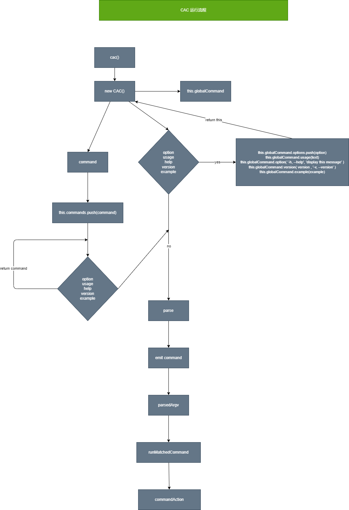

# CAC 源码学习

## 目录结构

```javascript
-- .github           // 关于github一些配置的文件
--  examples         // 一些案例
--  scripts          // 关于打包的一些文件
--  src              // 源代码
-- .editorconfig     // 开发者编码风格配置文件
-- .gitattributes    // 规范提交仓库文件
-- .gitignore        // 配置需要忽略提交到仓库的文件
-- .prettierrc       // 配置 prettier 插件格式化的文件
--  circle.yml       // circle 持续集成配置文件
--  jest.config.js   // jest 配置文件
--  LICENSE          // 开源协议文件
--  package.json     // npm 配置文件
--  rollup.config.js // rollup 配置文件
--  tsconfig.json    // typescript 配置文件
--  yarn.lock        // yarn 安装一些包的信息
```

## 分析package.json 字段

```javascript
"name"            // 名字
"version"         // 版本
"description"     // 描述
"repository"      // 仓库地址 可以通过 npm docs 找到仓库
"main"            // require 这个包的入口
"module"          // 使用 esm 模块化的入口
"types"           // ts 类型文件入口
"exports"         // 添加导入映射 区分不同的导入环境
"files"           // 用于描述需要下载这个包的哪些文件
"scripts"         // 配置命令
"author"          // 作者信息
"license"         // 包协议
"devDependencies" // 构建时的依赖
"engines"         // 描述这个包node最新版本
"config"          // 配置对象
"keywords"        // npm 搜索关键词
```

## 写一个库的 README 需要哪几个部分？

```javascript
Title 
Description
Installation
guide
```

- 有哪些可以快速生成 readme 的库?
  - readme-md-generator

## 流程图

[点这里🖱](./flow.drawio )



## 如何实现链式调用的API

链式调用实现很简单，我们知道只有object才可以实现 `xxx.fn()` 的方式，那么我们只需要每次执行完fn的时候返回一个object不就完事了🙂

```js
const obj = {
    fn1(){
        console.log("fn1");
        return this;
    },
    fn2(){
        console.log("fn2");
        return this;
    }
}
```

所以再 `CAC` 中的 command option ... 都只需要返回 this 即可实现链式调用

## 核心解析

CAC 核心包括以下内容：

- command

command 这个类用来承载所有的命令，每一个command上面又可以有很多的option，那么为什么我可以通过 `cac.option` 添加option 呢？其实 `new CAC` 的时候它默认会有添加一个 `globalCommand`

- option

option 用来存一些选项的

- action

action用来执行之前定义的一些命令和option
